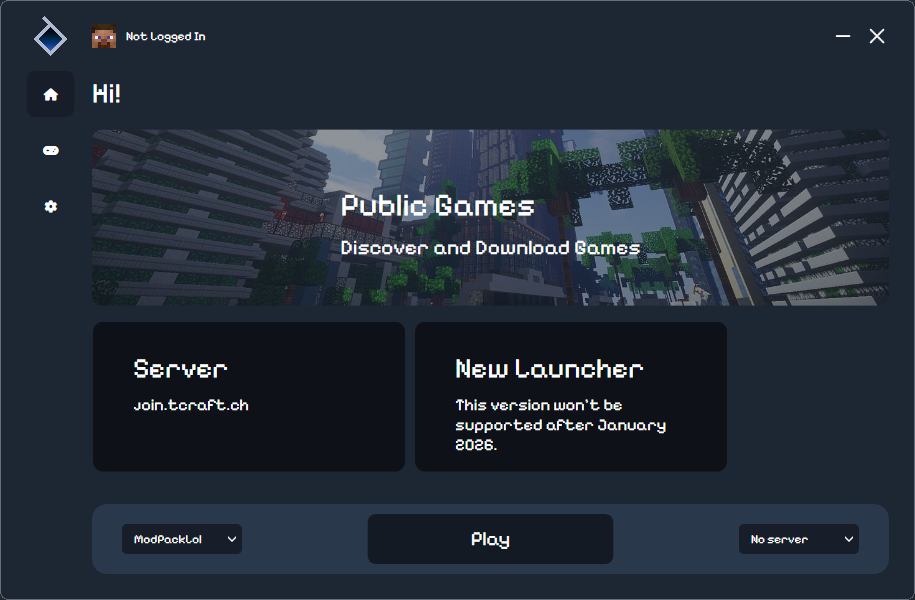

<h1 align="center">
   
  
   
  TCLauncher
   
</h1>

<h4 align="center">A C# application that allows a secure connection to Minecraft servers and a fast switching between instances.⚡</h4>

  
  
  

  <a href="#about">About</a> •
  <a href="#installation">Installation</a> •
  <a href="#system-requirements">System Requirements</a> •
  <a href="#public-games">Public Games</a> •
  <a href="#your-own-games">Your own Games</a>

## About
TCLauncher enables secure connections to Minecraft servers and allows for fast switching between instances. TCLauncher offers a user-friendly interface based on the .NET Framework 4.8 and WPF.

TCLauncher is continuously developed by t9craft. T-Craft is happy to provide the software under the MIT license.

Download TCLauncher and experience lightning-fast switching between instances!

## Installation
To install TCLauncher, follow these steps:

- Download the latest version of TCLauncher from our [Website](https://tcraft.link/tclauncher) or from [Releases](https://github.com/TD99/T-Craft-Game-Launcher/releases/latest).
- Run the installer and follow the on-screen instructions.
- Once the installation is complete, launch TCLauncher and start exploring!

## System Requirements
To run TCLauncher (not the instances!), your system must meet the following requirements:
- Operating System: Windows 10 or later
- Processor: Intel Core i3 or equivalent
- Memory: 2GB RAM
- Graphics: DirectX 11 compatible GPU
- Storage: 50MB available space

## Public Games
With TCLauncher, you can discover and download a variety of public games. Browse through our selection of games and find your next adventure!

## Your own Games
We're working on this feature.
